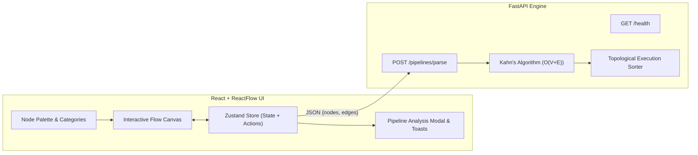

# Visflow — Visual Workflow & AI Pipeline Builder


A modern, glassmorphic visual workflow pipeline builder built with **React**, **ReactFlow**, **Zustand**, and **FastAPI**. Users can interactively construct pipelines on a dark cyber canvas using extensible node components, wire data streams together, test pre-built templates, and analyze DAG structures with Kahn's Algorithm on the backend.

---

## ⚡ Key Highlights & UI/UX Features

- **💎 Modern Dark Glassmorphism Design System**: Built with Plus Jakarta Sans and JetBrains Mono typography, radial glow backgrounds, glassmorphic panels, and neon accent borders.
- **✨ One-Click Starter Templates**: Pre-configured pipeline templates (*AI Q&A Chain*, *Document Summarizer & Classifier*, *API Data Transformer*) ready to load instantly.
- **📊 Interactive Pipeline Inspector Modal**: Detailed topological execution order timeline, connected component counts, cycle node diagnostics, and raw graph JSON export.
- **🏷️ Categorized Node Toolbar**: Filter nodes by category (*All*, *AI & Models*, *Data I/O*, *Logic & Math*, *Services*, *Notes*) with live search filtering.
- **❌ In-Node Delete & Controls**: Quick-delete buttons directly on nodes, custom form controls, and glowing connection ports.
- **📝 Dynamic Text & Variable Extraction**: Automatic parsing of `{{variable}}` tokens into real-time input ports with token badges and canvas-measured auto-resizing.
- **⚡ Hotkeys**: Press <kbd>Ctrl</kbd>+<kbd>Enter</kbd> (or <kbd>Cmd</kbd>+<kbd>Enter</kbd>) anytime to verify and analyze the current pipeline graph.

---

## 🏗️ Architecture Overview



---

## 🧩 Node Abstraction (`BaseNode` & `createNode`)

Instead of repeating markup boilerplate across nodes, Visflow uses a declarative **config-driven factory**:

```js
export const FilterNode = createNode({
  title: 'Filter',
  icon: '🔍',
  accent: '#f59e0b',
  fields: [
    { name: 'condition', label: 'Condition', type: 'text', defaultValue: 'value > 0' }
  ],
  targetHandles: [{ id: 'input' }],
  sourceHandles: [{ id: 'output' }],
});
```

### Registered Node Types

| Node Type | Category | Signature Color | Purpose |
| :--- | :--- | :--- | :--- |
| **Input** | Data I/O | Blue (`#3b82f6`) | Feed text or file data into the pipeline |
| **Output** | Data I/O | Emerald (`#10b981`) | Final pipeline destination / result display |
| **LLM Engine** | AI & Models | Violet (`#8b5cf6`) | AI model inference (GPT-4o, Claude 3.5, Gemini 1.5) |
| **Text / Prompt** | AI & Models | Rose (`#ec4899`) | Dynamic prompt engineering with `{{var}}` handle generation |
| **Filter** | Logic & Math | Amber (`#f59e0b`) | Conditional branching / logic expressions |
| **Math** | Logic & Math | Crimson (`#ef4444`) | Mathematical calculations (`Add`, `Multiply`, etc.) |
| **API Request** | Services | Cyan (`#06b6d4`) | External HTTP REST API integration |
| **Delay** | Services | Purple (`#a855f7`) | Pipeline rate limiting / step delay |
| **Note** | Notes | Slate (`#64748b`) | Collaborative canvas annotations |

---

## 🚀 Running the Project

### 1. Backend (FastAPI)

```bash
cd backend
pip install -r requirements.txt
uvicorn main:app --reload --port 8000
python -m pytest        # Run test suite (12 passed)
```

### 2. Frontend (React)

```bash
cd frontend
npm install
npm start               # Starts dev server on http://localhost:3000
npm test -- --watchAll=false # Run test suite (18 passed)
```

---

## 🧪 Testing & Verification

- **Backend Tests (`pytest`)**: 12 automated unit tests validating empty pipelines, chains, diamond DAGs, self-loops, disconnected subgraphs, topological execution order, and API endpoints.
- **Frontend Tests (`jest`)**: 18 unit tests validating variable regex extraction, proportional text width calculations, and cycle prevention logic.


